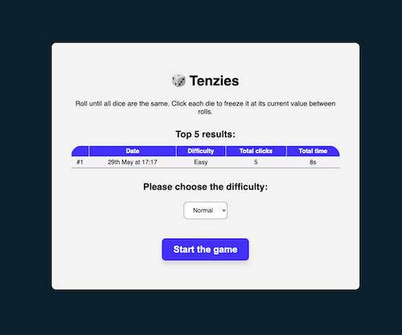

# Tenzies Warm-up

A simple warm-up React project to implement the game Tenzies.

## Project Description

Tenzies Warm-up is a simple React project designed to refresh React skills by recreating the Tenzies game.

### Features

- Three difficulty modes: Easy, Normal, Hard
- Tracks time and number of clicks needed to win
- Displays top 5 best results on the dashboard

## Table of Contents

- [Installation](#installation)
- [Usage](#usage)
- [Scripts](#scripts)
- [Dependencies](#dependencies)
- [Dev Dependencies](#dev-dependencies)
- [Author](#author)
- [License](#license)

## Installation

1. Clone the repository:
   `git clone https://github.com/yourusername/tenzies-warmup.git`
2. Navigate to the project directory:
   `cd tenzies-warmup`
3. Install the dependencies:
   `yarn install`

## Usage

To start the development server, run:
`yarn run dev`

To build the project for production, run:
`yarn run build`

To preview the production build, run:
`yarn run preview`

## Scripts

- `dev`: Starts the Vite development server.
- `build`: Builds the project for production using Vite.
- `preview`: Previews the production build using Vite.
- `format`: Formats the code using Prettier.
- `type-check`: Checks TypeScript types.
- `lint`: Lints the code using ESLint.
- `prepare`: Prepares the project by running Husky.
- `test`: Runs Jest tests with coverage.
- `test:watch`: Runs Jest tests in watch mode with coverage.
- `test:update`: Updates Jest snapshots.
- `test:clear`: Clears Jest cache.
- `lint-staged`: Runs linting on staged git files before committing.
- `update-snapshots`: Updates Jest snapshots for changed `.tsx` files before committing.

## Dependencies

- `lodash`: ^4.17.21
- `react`: ^18.3.1
- `react-confetti`: ^6.1.0
- `react-dom`: ^18.3.1
- `react-use`: ^17.5.0
- `date-fns`: "^3.6.0",
- `date-fns-tz`: "^3.1.3",

## Dev Dependencies

- `@testing-library/jest-dom`: ^6.4.6
- `@testing-library/react`: ^16.0.0
- `@testing-library/user-event`: ^14.5.2
- `@types/jest`: ^29.5.12
- `@typescript-eslint/eslint-plugin`: 6.0.0
- `@typescript-eslint/parser`: 6.0.0
- `@vitejs/plugin-react`: 4.2.1
- `autoprefixer`: ^10.4.19
- `eslint`: 8.2.0
- `eslint-config-airbnb-typescript`: ^16.0.0
- `eslint-config-node`: ^4.1.0
- `eslint-config-prettier`: ^8.0.0
- `eslint-import-resolver-typescript`: ^3.6.1
- `eslint-plugin-deprecation`: ^2.0.0
- `eslint-plugin-import`: ^2.25.2
- `eslint-plugin-jest-dom`: ^5.4.0
- `eslint-plugin-jsx-a11y`: ^6.7.0
- `eslint-plugin-node`: ^11.1.0
- `eslint-plugin-package-json`: ^0.12.0
- `eslint-plugin-prettier`: ^5.1.3
- `eslint-plugin-react`: ^7.28.0
- `eslint-plugin-react-hooks`: ^4.6.0
- `eslint-plugin-testing-library`: ^6.2.2
- `husky`: ^9.0.11
- `identity-obj-proxy`: ^3.0.0
- `jest`: ^29.7.0
- `jest-environment-jsdom`: ^29.7.0
- `jsonc-eslint-parser`: 2.0.0
- `lint-staged`: "^15.2.7",
- `nanoid`: ^5.0.7
- `postcss`: ^8.4.38
- `prettier`: ^3.2.5
- `sass`: ^1.77.2
- `ts-jest`: ^29.1.5
- `ts-node`: ^10.9.2
- `typescript`: 5.4.5
- `vite`: 5.2.11

## Author

Oleksii Suprun  
Email: oleksii.suprun.email@gmail.com

## License

This project is licensed under the MIT License. See the [LICENSE](LICENSE) file for details.
