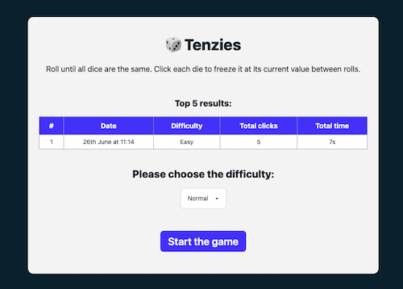

# Tenzies Warm-up

A simple warm-up React project to implement the game Tenzies.

## Project Description

Tenzies Warm-up is a simple React project designed to refresh React skills by recreating the Tenzies game.

### Features

- Three difficulty modes: Easy, Normal, Hard
- Tracks time and number of clicks needed to win
- Displays top 5 best results on the dashboard

### Notable Libraries and Technologies

- <b>React</b>: A JavaScript library for building user interfaces.
- <b>TypeScript</b>: A typed superset of JavaScript that compiles to plain JavaScript.
- <b>Vite</b>: A build tool that provides a faster and leaner development experience for modern web projects.
- <b>Vitest</b>: A blazing-fast unit test framework powered by Vite.
- <b>ESLint</b>: A static code analysis tool for identifying problematic patterns found in JavaScript code.
- <b>Prettier</b>: An opinionated code formatter.
- <b>Husky</b>: Git hooks made easy.
- <b>Lint-staged</b>: Run linters on git staged files.
- <b>Lodash-ES</b>: A modern JavaScript utility library delivering modularity, performance & extras.
- <b>TailwindCSS</b>: A utility-first CSS framework for rapidly building custom user interfaces.
- <b>Cypress</b>: Fast, easy and reliable testing for anything that runs in a browser.
- <b>React Confetti</b>: Confetti for React applications.

## Table of Contents

- [Installation](#installation)
- [Usage](#usage)
- [Scripts](#scripts)
- [Dependencies](#dependencies)
- [Dev Dependencies](#dev-dependencies)
- [Author](#author)
- [License](#license)

## Installation

1. Clone the repository:
   `git clone https://github.com/yourusername/tenzies-warmup.git`
2. Navigate to the project directory:
   `cd tenzies-warmup`
3. Install the dependencies:
   `yarn install`

## Usage

To start the development server, run:
`yarn run dev`

To build the project for production, run:
`yarn run build`

To preview the production build, run:
`yarn run preview`

## Scripts

- `dev`: Starts the Vite development server.
- `build`: Builds the project for production using Vite.
- `preview`: Previews the production build using Vite.
- `format`: Formats the code using Prettier.
- `type-check`: Checks TypeScript types.
- `lint`: Lints the code using ESLint.
- `prepare`: Prepares the project by running Husky.
- `lint-staged`: Runs linting on staged git files before committing.
- `cy:open`: Opens Cypress test runner.
- `cy:coverage`: Generates Cypress coverage report.
- `test`: Runs Vitest tests with coverage.
- `test:watch`: Runs Vitest tests in watch mode with coverage.
- `test:update`: Updates Vitest snapshots.
- `update-snapshots`: Runs Vitest tests with coverage on changed files and updates snapshots.

## Dependencies

- `lodash-es`: ^4.17.21
- `react`: ^18.3.1
- `react-confetti`: ^6.1.0
- `react-dom`: ^18.3.1
- `usehooks-ts`: ^3.1.0
- `i18next`: "^23.11.5"
- `i18next-browser-languagedetector`: "^8.0.0",

## Dev Dependencies

- `@commitlint/cli`: ^19.3.0
- `@commitlint/config-conventional`: ^19.2.2
- `@cypress/code-coverage`: ^3.12.39
- `@eslint/eslintrc`: ^3.1.0
- `@istanbuljs/nyc-config-typescript`: ^1.0.2
- `@swc/core`: ^1.6.3
- `@swc/jest`: ^0.2.36
- `@testing-library/dom`: ^10.2.0
- `@testing-library/jest-dom`: ^6.4.6
- `@testing-library/react`: ^16.0.0
- `@types/cypress`: ^1.1.3
- `@types/lodash-es`: ^4.17.12
- `@types/node`: ^20.14.5
- `@typescript-eslint/eslint-plugin`: ^7.14.1
- `@typescript-eslint/parser`: ^7.14.1
- `@vitejs/plugin-react`: 4.2.1
- `@vitest/ui`: ^1.6.0
- `autoprefixer`: ^10.4.19
- `camelcase`: 6
- `cypress`: ^13.12.0
- `daisyui`: ^4.12.8
- `eslint`: ^9.6.0
- `eslint-config-airbnb-typescript`: ^18.0.0
- `eslint-config-node`: ^4.1.0
- `eslint-config-prettier`: ^9.1.0
- `eslint-import-resolver-typescript`: ^3.6.1
- `eslint-plugin-deprecation`: ^3.0.0
- `eslint-plugin-import`: ^2.29.1
- `eslint-plugin-jest-dom`: ^5.4.0
- `eslint-plugin-jsx-a11y`: ^6.9.0
- `eslint-plugin-node`: ^11.1.0
- `eslint-plugin-package-json`: ^0.15.0
- `eslint-plugin-prettier`: ^5.1.3
- `eslint-plugin-react`: ^7.34.3
- `eslint-plugin-react-hooks`: ^4.6.2
- `eslint-plugin-testing-library`: ^6.2.2
- `husky`: ^9.0.11
- `jsdom`: ^24.1.0
- `jsonc-eslint-parser`: 2.0.0
- `lint-staged`: ^15.2.7
- `nanoid`: 5.0.7
- `nyc`: ^17.0.0
- `postcss`: ^8.4.38
- `prettier`: 3.2.5
- `prettier-plugin-tailwindcss`: ^0.6.5
- `tailwindcss`: ^3.4.4
- `ts-node`: ^10.9.2
- `typescript`: 5.4.5
- `vite`: 5.2.11
- `vite-plugin-istanbul`: ^6.0.2
- `vitest`: ^1.6.0

## Author

Oleksii Suprun  
Email: oleksii.suprun.email@gmail.com

## License

This project is licensed under the MIT License. See the [LICENSE](LICENSE) file for details.
